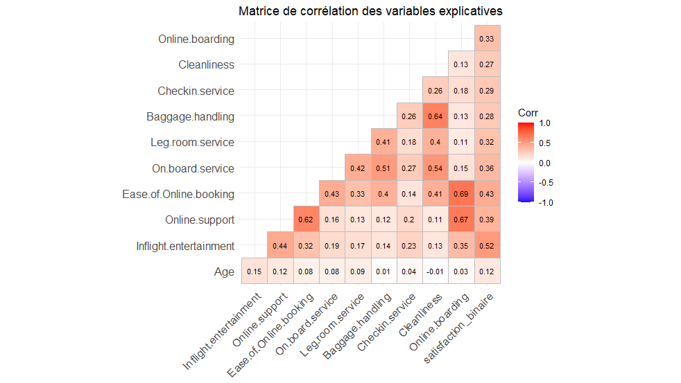
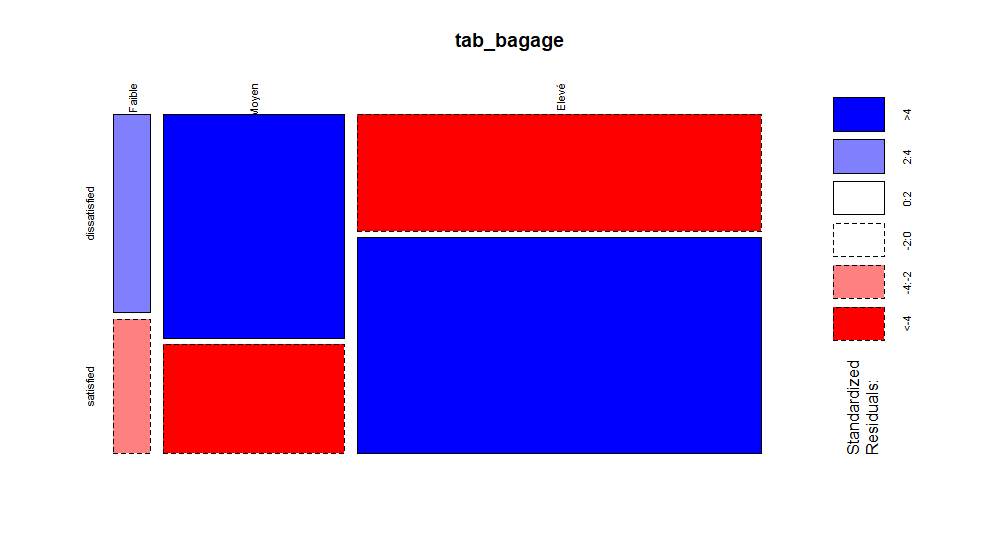
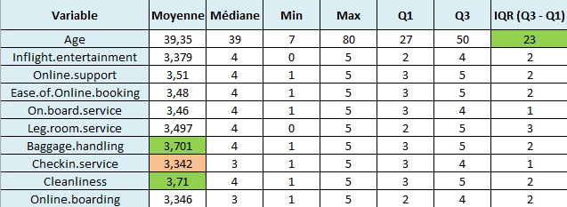

# Facteurs de satisfaction des passagers aériens

*Statistical analysis (R) of airline passenger satisfaction survey data — correlation, chi-square independence tests, and non-parametric group comparisons. English summary below.*

Projet réalisé en binôme avec **Sara El Amri** dans le cadre du Master 1
Data Analyst (IAE Paris-Est, Université Gustave Eiffel).

## Problématique

Quels sont les facteurs les plus déterminants dans la satisfaction des
clients d'une compagnie aérienne ?

## Données

Jeu de données public **Airline Passenger Satisfaction**
([Kaggle](https://www.kaggle.com/datasets/sjleshrac/airlines-customer-satisfaction)),
portant sur une compagnie aérienne fictive ("Invistico Airlines"). Après
échantillonnage aléatoire (5 000 observations) et sélection des variables
pertinentes, la base finale comporte 15 variables : profil du passager
(âge, genre, type de client, type de voyage, classe) et scores de
satisfaction sur différents aspects du service (divertissement en vol,
réservation en ligne, service à bord, propreté, manutention des bagages,
etc.).

## Démarche

1. **Nettoyage et exploration** — vérification des valeurs manquantes,
   échantillonnage, sélection des variables
2. **Analyse univariée** — statistiques descriptives, distributions
   (histogrammes, boxplots) pour les variables quantitatives et
   qualitatives
3. **Analyse bivariée**
   - Corrélations de Pearson entre les scores de service et la
     satisfaction (binarisée)
   - Tests du chi² d'indépendance entre satisfaction et variables
     qualitatives (genre, type de client, classe...), avec mosaicplots et
     résidus standardisés
   - Construction de deux scores agrégés — **Score Digital**
     (support en ligne, réservation en ligne, enregistrement en ligne) et
     **Score Physique** (service à bord, espace jambes, bagages,
     enregistrement, propreté, divertissement)
4. **Comparaison de groupes (Business vs Eco)** — test t de Student
   (Welch), test de normalité de Shapiro-Wilk, puis test de Wilcoxon
   (rangs) une fois la non-normalité établie

## Résultats clés

Les corrélations les plus fortes avec la satisfaction concernent le
divertissement en vol (r ≈ 0,52), la facilité de réservation en ligne
(r ≈ 0,43) et la qualité du service en ligne (r ≈ 0,39).



Les tests du chi² confirment des associations significatives (p < 0,05)
entre la satisfaction et plusieurs variables qualitatives, dont la
manutention des bagages :



Les scores Digital et Physique diffèrent significativement entre classes
Business et Eco (test t de Welch, p < 2,2e-16). Les distributions n'étant
pas normales (test de Shapiro-Wilk, p < 0,05 pour tous les groupes), ce
résultat a été confirmé par un test de Wilcoxon non-paramétrique, lui
aussi significatif — les passagers en Business évaluent systématiquement
plus favorablement les deux dimensions de service.



## Stack technique

R — `tidyverse`, `dplyr`, `MASS`, `Hmisc`, `rstatix`, `questionr`,
`pastecs`, `ggpubr`, `ggplot2`, `naniar`, `ggcorrplot`.

## Structure du dépôt

```
├── script/
│   └── analyse_satisfaction.R
├── data/
│   └── satisfaction_airline.csv     # source : Kaggle (voir lien ci-dessus)
├── report/
│   └── note_synthese.docx
└── presentation/
    └── Support_de_presentation.pptx
```

---

## English summary

This project (paired coursework with Sara El Amri, Master 1 Data Analyst)
analyzes the public Kaggle "Airline Passenger Satisfaction" dataset to
identify the strongest drivers of passenger satisfaction. After sampling
and cleaning, it runs univariate descriptive statistics, Pearson
correlations, chi-square independence tests (with standardized residuals
and mosaic plots) between satisfaction and categorical variables, and
builds two aggregated service scores (Digital and Physical). Business vs.
Eco class differences on both scores are tested with Welch's t-test,
checked against normality via Shapiro-Wilk, and confirmed with a
non-parametric Wilcoxon rank-sum test given the non-normal distributions.
In-flight entertainment and ease of online booking emerge as the service
dimensions most strongly correlated with overall satisfaction.
